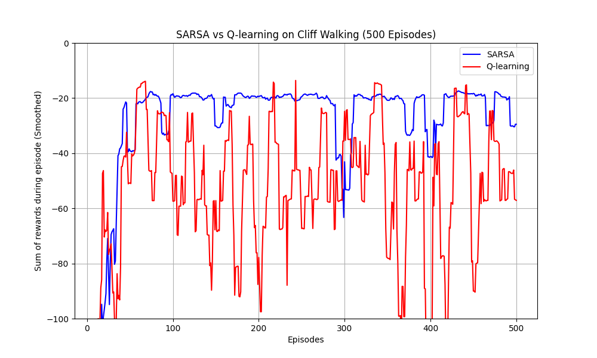
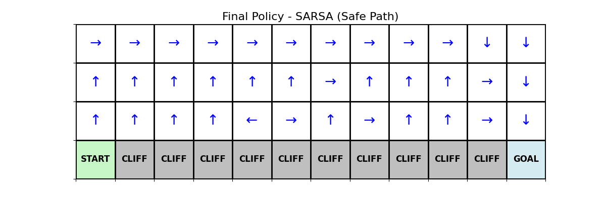

# Cliff Walking: Q-learning vs. SARSA

## 📌 Project Overview
本專案為強化學習 (Reinforcement Learning) 的經典作業，旨在實作與比較 **On-policy (SARSA)** 與 **Off-policy (Q-learning)** 演算法在 Cliff Walking (懸崖探索) 網格世界環境中的行為差異。

透過這個 4x12 的網格環境，我們觀察這兩種演算法如何在探索 (Exploration) 與利用 (Exploitation) 的妥協中，學習到截然不同的路徑策略。

## ⚙️ Implementation Details
- **Environment**: 4x12 Grid World 
  - 起點：`(3,0)`
  - 終點：`(3,11)`
  - 懸崖：`(3,1)` 到 `(3,10)`，踩入懸崖獲得 -100 reward 且被傳送回起點。一般移動 reward 為 -1。
- **Algorithms**: SARSA (On-policy) & Q-learning (Off-policy)
- **Policy**: $\epsilon$-greedy strategy
- **Hyperparameters**:
  - 探索率 ($\epsilon$, Epsilon): `0.1`
  - 學習率 ($\alpha$, Alpha): `0.5`
  - 折扣因子 ($\gamma$, Gamma): `0.9`
  - 訓練回合數 (Episodes): `500`

## 📊 Results

### 累積獎勵曲線比較 (Learning Curve)
*(透過 Moving Average 平滑化以方便比較兩者趨勢)*



### 最終路徑策略對比 (Policy Maps)

| Algorithm | Policy Map | Behavior Analysis |
| :---: | :--- | :--- |
| **SARSA**<br>*(On-policy)* |  | **保守策略 (Conservative)**<br>因為更新時會考量 $\epsilon$-greedy 的隨機性，深知靠近懸崖有 10% 機率因隨機探索而跌落。為規避此風險，SARSA 選擇繞遠路的安全路徑，換取訓練期更高的平均累積獎勵。 |
| **Q-learning**<br>*(Off-policy)* |  | **激進最佳策略 (Aggressive/Optimal)**<br>更新時永遠樂觀外推，假設未來總是採取最佳行動 ($\max Q$)，忽略了實際執行時必定有的隨機抖動。最終學到貼近懸崖邊的理論最短路徑，但訓練期很容易因手抖而摔落。 |

## 🚀 How to Run

### 1. 安裝依賴環境
我們建議使用 Python 3.8 以上的開發環境，請在終端機內輸入以下指令安裝所需套件：

```bash
pip install -r requirements.txt
```

### 2. 執行主程式
本專案已經將環境、演算法訓練與圖表繪製整合，只要執行以下指令，即會進行 500 回合訓練並在當下目錄產出相應結果圖：

```bash
python plot_results.py
```
> *(執行完畢後會產生 `rewards_curve.png`, `sarsa_policy.png`, 與 `q_learning_policy.png`)*
